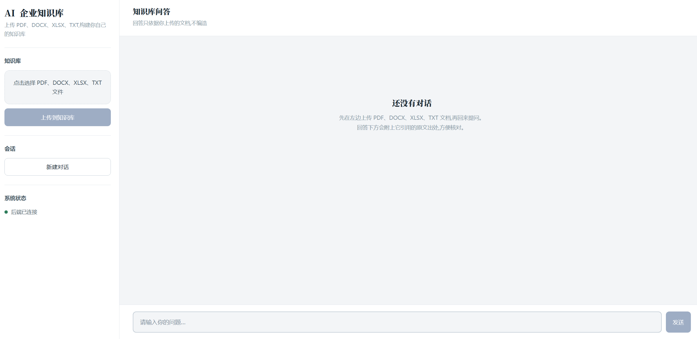
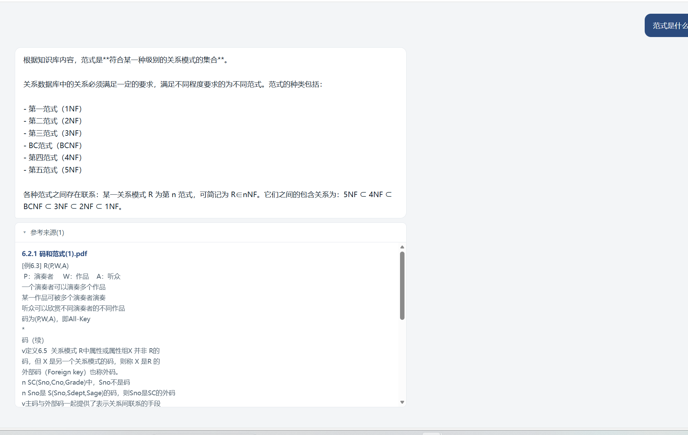
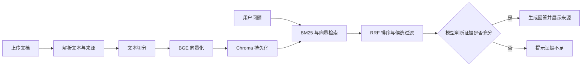

# AI Knowledge Base

基于 **Vue 3 + FastAPI + LangChain + Chroma + 本地 BGE Embedding + DeepSeek API** 的企业知识库项目。支持上传文档、检索相关内容，并生成附带参考来源的回答。

项目重点实现从多格式文档解析到混合检索、证据判断及答案生成的完整 RAG 流程。

## 核心亮点

- **多格式文档入库**：支持 PDF、Word、Excel、TXT，统一完成文本提取、切分、向量化和持久化，保留文档来源与表格位置信息。
- **混合检索**：结合 BM25 关键词检索与 BGE 向量检索，通过 RRF 融合排序，并根据原始向量距离与关键词覆盖率筛选候选片段。
- **回答与来源一致**：生成答案前调用模型判断候选是否提供足够证据，答案与来源使用相同的已验证片段；证据不足时提示未找到相关内容。

## 效果展示

### 多格式文档上传界面

上传入口支持 PDF、DOCX、XLSX、TXT，页面同时展示问答入口与后端连接状态。



### 知识问答与参考来源

以数据库范式问题为例，展示生成的回答及展开后的文档来源和原文片段，便于核对回答依据。



## 工作流程



## 功能

- PDF、`.docx`、`.xlsx`、TXT 上传，单文件最大 20 MB。
- Word 正文与表格解析；Excel 多工作表解析，保留行列位置、零值、布尔值和公式字符串。
- TXT 支持 UTF-8（含 BOM）、带 BOM 的 UTF-16、GB18030。
- 文本切分参数：`chunk_size=500`、`chunk_overlap=50`。
- 本地 `BAAI/bge-small-zh-v1.5` Embedding，Chroma 持久化，jieba 中文分词与 LangChain 混合检索组件。
- 同文件名、同文本分块生成稳定 ID，重复上传时复用 ID。
- Vue 聊天界面、上传状态、参考来源、页面内聊天记录和新建对话。
- 文件类型、大小、空文本及解析异常校验，后端健康检查、日志和异常处理。

## 技术栈与目录

| 技术 | 用途 |
| --- | --- |
| Vue 3 | 文档上传、问答交互和来源展示 |
| FastAPI / Uvicorn | HTTP API |
| pypdf / pdfplumber / python-docx / openpyxl | 多格式文档解析 |
| LangChain | 文本切分、Embedding 与混合检索组件 |
| BAAI/bge-small-zh-v1.5 | 本地中文 Embedding |
| Chroma | 向量存储与相似度检索 |
| BM25 / jieba / RRF | 关键词检索、中文分词与排序融合 |
| DeepSeek API | 证据判断与答案生成 |
| Docker Compose / Nginx | 容器配置与前端静态服务 |

```text
backend/
  main.py                 HTTP 路由、上传和问答
  file_utils.py           文档解析入口
  pdf_utils.py            PDF 文本解析
  text_splitter.py        文本切分
  vector_store.py         Embedding、Chroma、去重和检索
frontend-web/
  index.html              Vue 页面与交互
  vue.global.prod.js      本地 Vue 运行库
  LICENSE.vue             Vue MIT 许可
Dockerfile
docker-compose.yml
requirements.txt
.env.example
```

## 本地运行（Windows PowerShell）

### 1. 安装依赖

```powershell
git clone https://github.com/explorer-830/AI_Knowledge_Base.git AI_Knowledge_Base
cd AI_Knowledge_Base
python -m venv .venv
.\.venv\Scripts\Activate.ps1
python -m pip install -r requirements.txt
Copy-Item .env.example .env
```

### 2. 配置模型与密钥

编辑 `.env`：

```dotenv
DeepSeek_API_key=your_api_key_here
EMBEDDING_MODEL_PATH=D:/models/bge-small-zh-v1.5
EMBEDDING_MODEL_HOST_PATH=D:/models/bge-small-zh-v1.5
```

`EMBEDDING_MODEL_PATH` 为本地 Python 使用的完整模型目录。需提前准备好 BGE 权重、配置及 tokenizer 文件；项目离线加载模型，不会在启动时自动下载。

`EMBEDDING_MODEL_HOST_PATH` 仅用于 Docker 主机目录挂载，默认路径为 `./models/bge-small-zh-v1.5`。

### 3. 启动后端

在项目根目录运行：

```powershell
.\.venv\Scripts\python.exe -m uvicorn backend.main:app --reload --host 127.0.0.1 --port 8000
```

API 文档：<http://127.0.0.1:8000/docs>。

### 4. 启动前端

另开终端，在项目根目录运行：

```powershell
python -m http.server 4000 --bind 127.0.0.1 --directory frontend-web
```

打开 <http://127.0.0.1:4000>。使用本地 Vue 运行库，无需 Node.js、npm 或 CDN；请通过 HTTP 服务打开页面。

前端 `frontend-web/index.html` 中的 `API_BASE` 默认是 `http://127.0.0.1:8000`；后端 CORS 允许 `localhost:4000` 和 `127.0.0.1:4000`。更改地址或端口时需同步调整。远程部署需配置客户端可访问的 API 地址及对应 CORS。

## Docker Compose

准备 `.env` 和完整模型目录后运行：

```powershell
docker compose up --build
```

- 前端：<http://127.0.0.1:4000>，由 Nginx 提供静态页面。
- 后端：<http://127.0.0.1:8000>。
- `chroma_db/`、`uploads/` 挂载持久化；模型目录只读挂载。
- 密钥、虚拟环境、模型、上传文件和向量数据不提交 Git，也不打包进镜像。

Compose 配置已做静态校验，尚未完成容器启动及真实模型的端到端部署验证。

## API

| 方法 | 路径 | 功能 |
| --- | --- | --- |
| GET | `/` | 健康检查 |
| POST | `/upload` | multipart 文档上传；返回文件名、文本长度和分块数量 |
| POST | `/search` | 接收 `{"query":"问题"}`；返回内容、来源、RRF 分数、原始向量距离和关键词覆盖率 |
| POST | `/chat` | 接收 `{"query":"问题"}`；返回答案及来源 |

不支持的格式、空文件、无文本或损坏文件返回 400；超过 20 MB 返回 413；内部处理失败返回 500。上传处理使用同步路由，由 FastAPI 线程池执行解析、切分与 Embedding。

## 已完成验证

开发期间完成了文件解析与上传、编码、表格内容、非法输入、路径安全、存储异常，以及前端上传校验和异常响应的检查；部分检查使用替身隔离正式向量库。对应检查脚本当前未收录到仓库，尚未提供可直接运行的自动化测试套件。

已进行本地 BGE 混合检索评估、DeepSeek 证据判断及部分问答验证，并对 PDF 否定符号恢复进行了回归检查。这些验证不代表所有文档均可正确解析或所有问题均可准确回答。

## 当前限制

- 尚不支持 Markdown、CSV、旧版 DOC/XLS 或扫描图片 OCR；Excel 公式保留字符串，不重新计算。
- 聊天记录用于页面展示，后端按本次问题独立检索，尚无跨轮记忆。
- RRF 分数用于排序，不能作为原始向量距离；距离阈值和关键词覆盖率仍为实验参数。
- 证据判断增加一次模型调用，仍可能出现误召回或误拒答，需要更全面的效果评估。
- PDF 符号恢复不是 OCR，不保证所有公式均能正确解析。
- 尚未实现权限管理、多知识库隔离、文档删除及 Rerank，当前主要面向本地项目演示。
